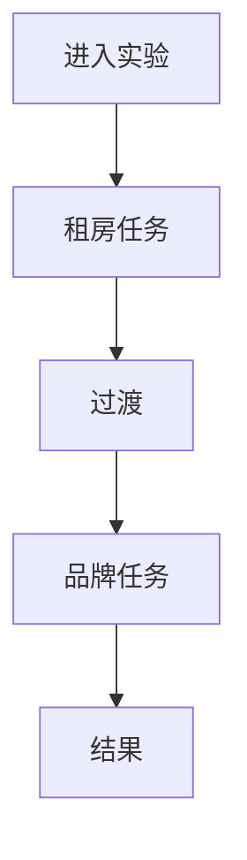

# Human-AI Performance Lab (V3)

Human-AI Performance Lab 是一个面向人机协作能力研究的连续测评实验系统。当前版本采用固定双场景路径：一个 session 内连续完成两个任务，再统一查看结果。

## 这是什么

- 一个基于 Next.js App Router + TypeScript 的实验应用。
- 固定双场景连续测评，不提供用户侧场景选择：
  1. `Apartment Trade-off`
  2. `Brand Naming Sprint`
- `Agent A` 负责显性引导，`Agent B` 在后台进行隐性评估（对普通用户不可见）。

## 为什么这不是考试

- 你不会被考 AI 常识，也没有标准答案压力。
- 系统关注的是你和 AI 如何协作推进、如何验证信息、如何修正策略。
- 输出用于理解当前协作表现，不用于单次高风险决策。

## 为什么用两个连续任务

- 单任务只能看到局部表现，连续任务才能观察迁移与调整能力。
- 第一段偏权衡决策，第二段偏创意迭代，组合后能形成更完整的协作画像。
- 结果页只在第二段结束后开放，保证整体过程数据完整。

## 结果会呈现什么

- **AI-MBTI（描述性）**：当前情境下的交互风格偏好，不代表稳定人格。
- **FAA（评价性）**：你在陌生任务中的 AI 适应力。
- Pilot 阶段 FAA 采用等权平均。

## 一次完整测评如何进行

1. 在首页点击“开始完整测试”。
2. 系统直接创建 session 并进入 `/lab/[sessionId]`。
3. 连续完成任务 1（公寓权衡）与任务 2（品牌命名），中途由系统自动过渡。
4. 全程持续写出“你的判断 + 理由 + 修正”。
5. 第二段完成后，自动开放结果页。



## 如何启动

```bash
npm install
npm run dev
```

打开 [http://localhost:3000](http://localhost:3000)，点击“开始完整测试”即可进入固定双场景连续测评。

常用命令：

```bash
npm run lint
npm run typecheck
npm run test
```

## 基础开发结构

- `app/page.tsx`：首页与启动入口
- `app/lab/[sessionId]/page.tsx`：连续双任务实验页
- `app/result/[sessionId]/page.tsx`：结果页（仅第二段完成后可访问）
- `components/home/*`：首页展示模块
- `components/lab/*`：实验页布局、时间线、调试与交互组件
- `server/engine/*`：场景推进、事件生成与评分编排

## 当前版本说明

- 首页无场景选择卡片，只有固定路径“开始完整测试”。
- 点击 CTA 后直接创建 `core-sequential-v1` session 并跳转 `/lab/[sessionId]`。
- 全站中文界面，代码与类型命名使用英文。
