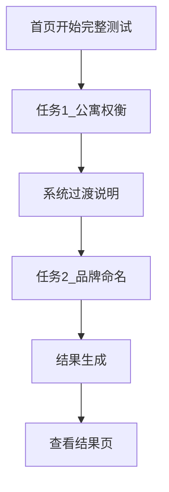

# Human-AI Performance Lab：通俗流程说明

## 你会经历什么

- 这是一套固定双任务流程，不需要选场景。
- 你会连续完成两个任务：
  1. 公寓权衡（任务 1）
  2. 品牌命名（任务 2）
- 两个任务在同一个测评编号里完成，结束后才会出结果。

## 你每一步要做什么

### 第一步：开始

- 在首页点击“开始完整测试”。
- 系统会创建一个“本次测评编号”，并进入任务 1。

### 第二步：任务 1（公寓权衡）

- 你要输出：
  - 4 套房排序
  - 最推荐 / 最不推荐
  - 权重说明
  - 给房东/中介的 5 个追问问题
- 建议写法：先说判断，再说依据，再说是否需要修正。

### 第三步：自动过渡

- 任务 1 达到要求后，系统会自动切到任务 2。
- 你不需要手动新建会话或回首页重开。

### 第四步：任务 2（品牌命名）

- 你要输出：
  - 3 个候选名字
  - 每个名字一句理由
  - 每个名字一条 tagline
  - 淘汰标准说明
- 同样建议持续说明“判断依据 + 修正过程”。

### 第五步：查看结果

- 只有任务 2 完成后才会生成结果页。
- 如果未完成第二个任务，结果页会提示你先返回流程继续完成。

## 系统在后台做了什么（简化版）

- Agent A：给你显性引导，帮助推进任务。
- Agent B：在后台做规则化评分（当前为 mock）。
- 系统会记录过程事件（append-only），用于复盘与结果生成。

## 一图看懂

